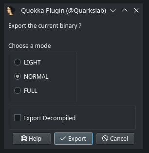

# Quokka

<p align="center">
	
</p>

image generated by [DALL-E](https://labs.openai.com/s/3k4LtWP564OYrVCIeoGmefMB)


---

Table of Contents
=================

* [Introduction](#introduction)
* [Installation](#installation)
* [Usage](#usage)
* [Building](#building)
* [Documentation](#documentation)
* [FAQ](#faq)

## Introduction

Quokka is a binary exporter: from the disassembly of a program, it generates
an export file that can be used without the disassembler. It currently supports
**IDA Pro** and **Ghidra** as disassembly backends.

The main objective of **Quokka** is to enable to completely manipulate the
binary without ever opening a disassembler after the initial export. Moreover, it
abstracts the disassembler's API to expose a clean interface to the users.

Quokka is heavily inspired by [BinExport](https://github.com/google/binexport),
the binary exporter used by BinDiff.

## Architecture

```
     IDA Pro               Ghidra
        │                      │
IDA Plugin (C++)    Ghidra Plugin (Java)
        │                      │
        └─── quokka.proto ─────┘
          (protobuf schema)
                   │
             .quokka files
                   │
   Python bindings (quokka.Program)
   ├── Capstone backend (primary)
   └── Pypcode backend (optional)
```

## Installation

### Python plugin

The plugin is built in the CI and available in the
[registry](https://github.com/quarkslab/quokka/packages).

It should be possible to install directly from PIP using this kind of commmand:

```commandline
$ pip install quokka-project
```

### IDA Plugin

Note: The IDA plugin is not needed to read a `Quokka` generated file. It is
only used to generate them.

Quokka is compatible with IDA 9.1+.

The plugin is built on the CI and available in the
[Releases](https://github.com/quarkslab/quokka/releases) tab.

To download the plugin, get the file named `quokka_plugin**.so`.

### Ghidra Extension

Quokka also supports exporting from **Ghidra** (>= 12.0.3) via a dedicated
extension. It produces the same `.quokka` protobuf files that the Python
library can load.

For build instructions, installation, and usage details see the
[Ghidra extension README](ghidra_extension/README.md).

## Usage

### Exporting via GUI

The first manual way to export a binary is to use the plugin inside IDA Pro.
The default shortcut inside IDA is `Alt+A`. It opens the following dialog:



Modes available are:

* LIGHT: Exports block-level data only *(instructions are decoded at runtime by Capstone from the original binary bytes)*
* FULL: Exports instructions and operands *(self-contained mode, does not require the original binary for disassembly)*

> **Note:** FULL mode is not yet implemented. Only LIGHT mode is currently functional.


### Exporting in headless

#### IDA

!!! note

    This requires a working IDA installation.

```commandline
$ idat -OQuokkaAuto:true -OQuokkaDecompiled:true -A /path/to/hello.i64
```

All available options are described in the [Usage](https://quarkslab.github.io/quokka/usage/).

Note: `idat` is used instead of `ida` to increase the export speed as graphical interface
is not needed.

#### Ghidra

```commandline
$ analyzeHeadless /tmp/proj Test \
    -import /path/to/binary \
    -scriptPath ghidra_extension/src/script/ghidra_scripts \
    -postScript QuokkaExportHeadless.java \
    --out=/path/to/output.quokka --mode=LIGHT
```

See the [Ghidra extension README](ghidra_extension/README.md) for more details.

### Exporting in CLI

Quokka provides a CLI utility tool to automatically export a single file or
all executable files of a given directory in parallel.
It supports both IDA Pro and Ghidra backends:

```commandline
$ quokka-cli --backend ghidra -t 8 dir/
$ quokka-cli --backend ida --ida-path /opt/ida -t 8 dir/
$ quokka-cli -t 8 dir/                          # auto-detect backend
```

Run `quokka-cli --help` for all options. Key flags include:

* `-b`, `--backend` to choose the disassembler backend (`ida`, `ghidra`, or `auto`)
* `-i`, `--ida-path` to provide the path to the IDA installation directory (the folder containing `idat`)
* `--ghidra-path` to provide the Ghidra installation directory (overrides `GHIDRA_INSTALL_DIR`)
* `-m`, `--mode` to choose the export mode (`light` or `full`)
* `--decompiled` to enable decompiled code export (IDA only)
* `-v`, `--verbose` to enable verbose logging


### Loading an export file

```python
import quokka
from quokka.types import Disassembler

# Directly from the binary (auto-detects available backend)
ls = quokka.Program.from_binary("/bin/ls")

# Explicitly choose a backend
ls = quokka.Program.from_binary("/bin/ls", disassembler=Disassembler.GHIDRA)
ls = quokka.Program.from_binary("/bin/ls", disassembler=Disassembler.IDA)

# From the exported file
ls = quokka.Program("ls.quokka",  # the exported file
                    "/bin/ls")    # the original binary
```

### Editing and adding types

```python
# Add new types from C declarations
prog.add_type("struct context { int id; char name[64]; };")
prog.add_type("enum status { OK=0, ERROR=1 };")

# Save the .quokka file
prog.write()

# Or apply changes (including new types) back to the IDA database
prog.commit(database_file="ls.i64", overwrite=True)
```

See the full [editing documentation](https://quarkslab.github.io/quokka/write_feature/)
for details on renaming functions, setting prototypes, and more.

## Building

The process for building depends on which version of the IDA SDK you are using.
These two modes are also referred as *the new mode* and *the old mode*.

### IDA < 9.2 (The old way)

Since the IDA SDK is still proprietary code, you have to fetch it yourself and provide
its path to cmake through the option `-DIdaSdk_ROOT_DIR:STRING=path/to/sdk`

**NOTE:** This will also work on newer versions but it requires more steps from
the users as they will have to download the sdk themselves.

```console
user@host:~/quokka$ cmake -B build \ # Where to build
                          -S . \ # Where are the sources
                          -DIdaSdk_ROOT_DIR:STRING=path/to/ida_sdk \ # Path to IDA SDK 
                          -DCMAKE_BUILD_TYPE:STRING=Release \ # Build Type

user@host:~/quokka$ cmake --build build --target quokka_plugin -- -j
```

### IDA >= 9.2 (The new way)

Ida SDK has been finally [open sourced](https://github.com/HexRaysSA/ida-sdk) so there is no need
anymore to download it separately.

You can use the cmake option `-DIDA_VERSION=<major>.<minor>` to automatically sync it from github.

```console
user@host:~/quokka$ cmake -B build \ # Where to build
                          -S . \ # Where are the sources
                          -DIDA_VERSION=9.2 \ # IDA SDK version
                          -DCMAKE_BUILD_TYPE:STRING=Release \ # Build Type

user@host:~/quokka$ cmake --build build --target quokka_plugin -- -j
```

### Install

To install the plugin:

```console
user@host:~/quokka$ cmake --install build
```

In any case, the plugin will also be in `build/quokka-install`. You can
copy it to IDA's user plugin directory.

```console
user@host:~/quokka$ cp build/quokka-install/quokka*64.so $HOME/.idapro/plugins/
```

For more detailed information about building, see [Building](docs/installation.md#ida-plugin)

## Documentation
Documentation is available online at
[documentation](https://quarkslab.github.io/quokka/)

## FAQ
You can see a list of questions here [FAQ](docs/FAQ.md)

## Exporting modes

> **Note:** Only LIGHT mode is currently implemented. FULL (self-contained) mode is planned but not yet functional.

Quokka offers two modes to export the disassembly analysis: the **light mode** and the **self contained mode**.

The **light mode** focuses on exporting only essential information, producing fast and lightweight files. In this mode no information at instruction level or below is exported, so the capstone engine will be used at runtime to obtain the instructions' disassembly.

The **self contained mode** instead exports the full disassembly, exactly how the backend disassembler shows it. This will produce heavier files but it doesn't require depending on third party disassemblers at runtime.

It's important to note that both modes offer the same API in the python bindings.

> [!WARNING]
> From the *self contained mode* it is still possible to obtain the capstone instruction object
> but beware that the capstone disassembly might be different than the one exported by quokka
> (instructions might be splitted, merged, not supported, have different mnemonics, etc.).
> In general different binary analysis platforms produce different disassembly, keep this in mind
> when mixing capstone with the self contained mode.

For a complete overview of the difference between the two modes look at the table below:

|  | Light Mode | Self contained Mode |
| -------- | -------- | -------- |
| Functions | ✅ | ✅ |
| Basic Blocks | ✅ | ✅ |
| Instructions | ❌ | ✅ |
| Operands | ❌ | ✅ |
| Data References | ✅ | ✅ |
| Cross References | ✅ | ✅ |
| Sections/Layout | ✅ | ✅ |
| Decompilation | ✅¹ | ✅¹ |
| CFG drawing coordinates | ✅¹² | ✅¹² |

<sup>¹ Optionally enabled</sup>

<sup>² Currently not supported</sup>
