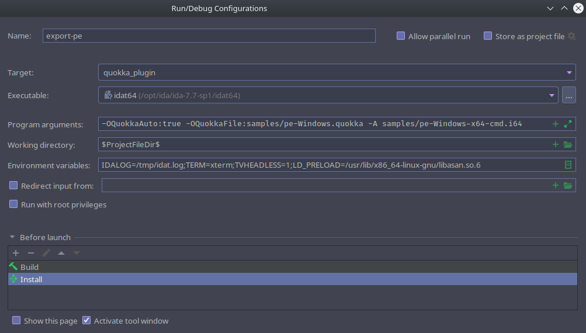

# Devs Tips & Tricks

## Debug the Plugin

First, generate a debug build using the option `CMAKE_BUILD_TYPE=Debug`. This will 
decrease the performances but allow to debug the plugin easily.

### Setup for CLion

It is possible to perform a `step-by-step` debug of the plugin while running with IDA.
The following steps are using [CLion](https://www.jetbrains.com/clion/) but are 
adaptable for other IDEs.

1. First, configure the Profiles for the project. The two most important options 
   are the SDK Root directory and the IDA bin directory.
   
2. Create a Run/Debug configuration
   
   - Set the target to `quokka_plugin`
   - Set the executable to be your `idat` file
   - Set arguments (the same you would use on the command line)
   - Add some environment variables:
     - IDALOG=/path/to/file Save the IDA's output in a file
     - TVHEADLESS=1 - Improve the speed
   - Set Build and Install as action before launch.

If you set a breakpoint in the code, you can now debug your plugin by simply 
running `Debug` in CLion interface.

### Use Sanitizers

By using the `ENABLE_SANITIZERS` option in `CMake`, you enable 
[ASan](https://github.com/google/sanitizers/wiki/AddressSanitizer).

Of note, to run with IDA, you need to specify the path to Asan using `LD_PRELOAD`.

## Running Tests

### For the plugin

The C++ tests are at best lackluster but the framework is here to improve them.

To compile tests:
```commandline
user@host:~/quokka$ cmake -B build-tests \ # Where to build 
                          -S . \ # Where are the sources
                          -DIdaSdk_ROOT_DIR:STRING=path/to/ida_sdk \ # Path to IDA SDK 
                          -DIda_BIN_DIR:STRING=/path/to/ida/dir \ # Path to IDA 
                          -DCMAKE_BUILD_TYPE:STRING=Debug \ # Build Type 
                          -DBUILD_TEST:BOOL=On
```

### For the Python bindings

The tests for the Python bindings are also limited but can be improved.
To run them, use the following command.

```commandline
user@host:~/quokka$ pytest tests/python
```
