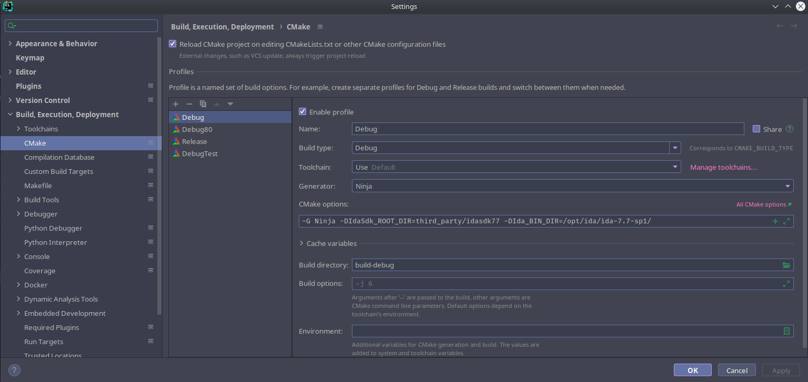
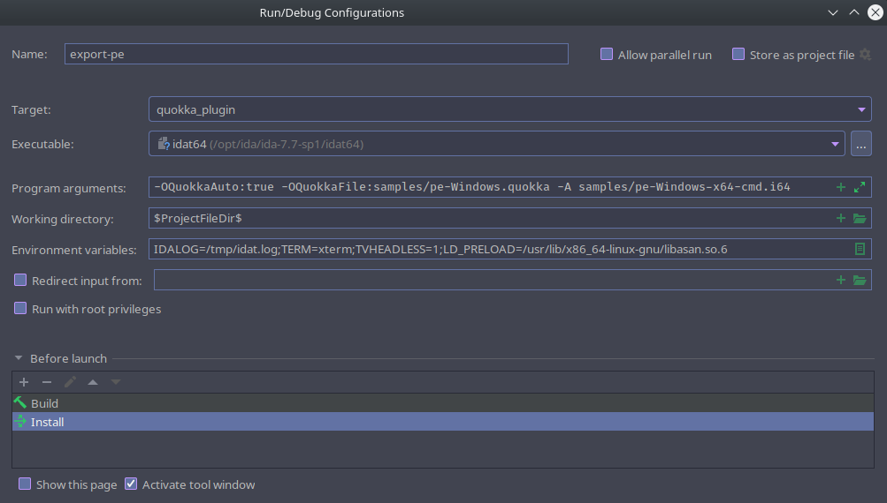

# Devs Tips & Tricks

## Debug the Plugin

First, generate a debug build using the option `CMAKE_BUILD_TYPE=Debug`. This will 
decrease the performances but allow to debug the plugin easily.

### Setup for CLion

It is possible to perform a `step-by-step` debug of the plugin while running with IDA.
The following steps are using [CLion](https://www.jetbrains.com/clion/) but are 
adaptable for other IDEs.

1. First, configure the Profiles for the project. The two most important options 
   are the SDK Root directory and the IDA bin directory.
   
2. Create a Run/Debug configuration
   
   - Set the target to `quokka_plugin`
   - Set the executable to be your `idat` file
   - Set arguments (the same you would use on the command line)
   - Add some environment variables:
     - IDALOG=/path/to/file Save the IDA's output in a file
     - TVHEADLESS=1 - Improve the speed
   - Set Build and Install as action before launch.

If you set a breakpoint in the code, you can now debug your plugin by simply 
running `Debug` in CLion interface.

### Use Sanitizers

By using the `ENABLE_SANITIZER` option in `CMake`, you enable
[ASan](https://github.com/google/sanitizers/wiki/AddressSanitizer).

Of note, to run with IDA, you need to specify the path to Asan using `LD_PRELOAD`.

## Running Tests

### For the plugin

The C++ tests are at best lackluster but the framework is here to improve them.

To compile and run the tests:

=== "IDA >= 9.2"

    ```console
    user@host:~/quokka$ cmake -B build-tests \
                              -S . \
                              -DIDA_VERSION=9.2 \
                              -DCMAKE_BUILD_TYPE:STRING=Debug \
                              -DBUILD_TEST:BOOL=On
    user@host:~/quokka$ cmake --build build-tests -- -j
    user@host:~/quokka$ ctest --test-dir build-tests
    ```

=== "IDA < 9.2"

    ```console
    user@host:~/quokka$ cmake -B build-tests \
                              -S . \
                              -DIdaSdk_ROOT_DIR:STRING=path/to/ida_sdk \
                              -DCMAKE_BUILD_TYPE:STRING=Debug \
                              -DBUILD_TEST:BOOL=On
    user@host:~/quokka$ cmake --build build-tests -- -j
    user@host:~/quokka$ ctest --test-dir build-tests
    ```

### For the Python bindings

```commandline
user@host:~/quokka$ pytest tests/python
```

### For the Ghidra extension

The Ghidra extension has JUnit tests:

```commandline
user@host:~/quokka$ cd ghidra_extension && ./gradlew test
```

Python integration tests for the Ghidra export require `GHIDRA_INSTALL_DIR` to be
set and the extension installed:

```commandline
user@host:~/quokka$ export GHIDRA_INSTALL_DIR="$(scripts/fetch_ghidra.sh)"
user@host:~/quokka$ pytest tests/python/tests/ghidra/ -v
```

Tests auto-skip when `GHIDRA_INSTALL_DIR` is unset or `analyzeHeadless` is not found.
